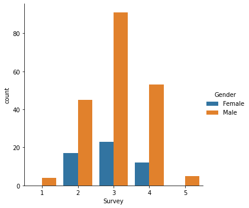
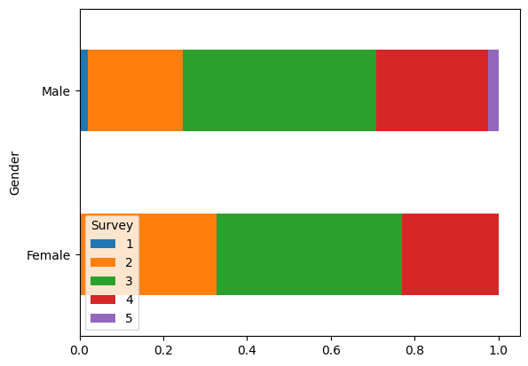

# bar chart

(NL: [staafdiagram](../nl/staafdiagram.md))

A *bar chart* is a chart type that displays the [frequencies](frequency.md) of the values of a [qualitative variable](level-of-measurement.md) using rectangles. The height of a bar represents the frequency of the corresponding value.

With a simple bar chart, you can visualize a single variable. To visualize two variables at the same time, you can use a clustered bar chart, a stacked bar chart or a [mosaic plot](mosaic-plot.md).

## Clustered bar chart

In a clustered bar chart, multiple bar charts are combined. The bar charts are grouped per value of the dependent variable, which is displayed on the X-axis. Distinction between the independent variable is usually made by color or shading of the bars.

Example:

- The colours denote the values of the [independent variable](variable-independent.md) `Gender`. Blue bars represent the values `Female` and orange bars represent the values `Male`.
- The [dependent variable](variable-dependent.md) `Survey` is displayed on the X-axis. Bars are grouped per value of `Survey`.
- If the "shape" of the bars in the different colors are similar, this is an indication that there is no [relation](association.md) between the variables. If there are large differences (e.g. a different [mode](mode.md), values that are not present in one of the groups, etc.), this is an indication that there is a relation between the variables.
- When there is a large difference between the number of observations for each value of the independent variable, or when the number of different values of the independent variable is large, it is hard to determine whether there is a relation. That's in fact the case for this plot: there are considerably less observations for `Female` than for `Male`. To solve this problem, you can use a stacked bar chart.

## Stacked bar chart

In a stacked bar chart, bars aren't clustered, but stacked on top of each other. Additionaly, it's useful to normalise the totals, so it's easier to compare the relative frequencies of the different values of the dependent variable.

Example:

- The [independent variable](variable-independent.md) `Gender` is displayed on the Y-axis
- The [dependent variable](variable-dependent.md) `Survey` is displayed on the X axis, each value is represented by a color.
- To make the differences in the proportions between the two groups clearer, the total of each group has been normalized to 100%. The height of the colored areas therefore represents the ratio, not the absolute number of observations.
- If the boundaries between the color planes are match up between the bars, then this is an indication that there is *no* [relationship](association.md) between the two variables. If there are large differences, then this is an indication that there *is* a relationship between the two variables.
    - In this diagram we see that the boundaries between the color areas are not quite at the same height, but broadly speaking similar proportions reappear. This is an indication that there is no or only a weak relationship between the two variables.
- Note that you can also display a bar chart vertically, but then you must ensure that it is plotted sufficiently large. Otherwise it is difficult to estimate the differences in the proportions.
- With a bar chart we do not see that there are more observations for `Male` than for `Female`. A [mosaicchart](mosaic-plot.md) can solve this problem. It retains the properties of a bar chart, but also shows the number of observations of the independent variable.
