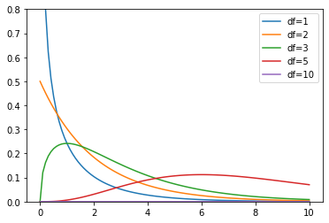

# chi-squared distribution

(NL: [chi-kwadraatverdeling](../nl/chi-kwadraatverdeling.md))

The **$\chi^2$ distribution** is a probability distribution used in statistics. The distribution depends on a parameter, namely the number of degrees of freedom. The $\chi^2$ distribution is often used in the context of the [$\chi^2$ test](chi-squared-test.md).

