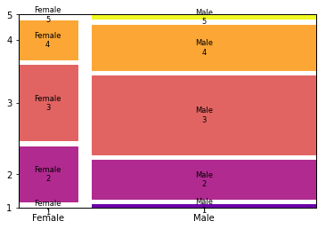

# mosaic plot

(NL: [mozaïekdiagram](../nl/mozaiekdiagram.md))

A mosaic plot is a graphical representation of a [contingency table](contingency-table.md) that shows the relative frequencies of the different combinations of values of two (or more) categorical variables.

The width of the rectangles in the plot is proportional to the relative frequency of the values of the first variable, and the height is proportional to the relative frequency of the values of the second variable. The area of each rectangle is thus proportional to the relative frequency of the combination of values of both variables.

The [independent variable](analysis-bivariate.md) is typically displayed on the x-axis and the dependent variable on the y-axis.
