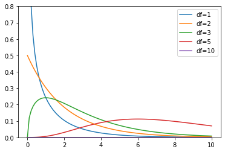

# chi-kwadraatverdeling

(EN: [chi-squared distribution](../en/chi-squared-distribution.md))

De **$\chi^2$-verdeling** is een kansverdeling die gebruikt wordt in de statistiek. De verdeling is afhankelijk van een parameter, namelijk het aantal vrijheidsgraden. De $\chi^2$-verdeling wordt vaak gebruikt in de context van de [$\chi^2$-toets](chi-kwadraattoets.md).

