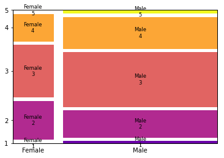

# mozaiekdiagram

(EN: [mosaic diagram](../en/mosaic-plot.md))

Een mozaïekdiagram is een grafische voorstelling van een [kruistabel](kruistabel.md) die de relatieve frequenties van de verschillende combinaties van de waarden van twee (of meer) categorische variabelen toont.

De breedte van de rechthoeken in het diagram is evenredig met de relatieve frequentie van de waarden van de eerste variabele, en de hoogte is evenredig met de relatieve frequentie van de waarden van de tweede variabele. De oppervlakte van elk rechthoek is dus evenredig met de relatieve frequentie van de combinatie van waarden van beide variabelen.

De [onafhankelijke variabele](analyse-van-twee-variabelen.md) wordt typisch op de x-as weergegeven en de afhankelijke op de y-as.
